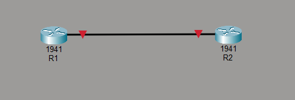

# CCNA Lab - Basic Router Configuration

## Topology

Two Cisco 1941 routers (R1 and R2) connected via their GigabitEthernet0/0 interfaces.



## Lab File
- `002 - Basic Router Security Configuration 2` - Packet Tracer file for this lab

## Steps & Answers

### 1. Connect the two routers by their GigabitEthernet0/0 interfaces
Connected R1's G0/0 port to R2's G0/0 port using a copper straight-through cable in Packet Tracer.

### 2. Set the hostname of each router according to the network diagram (R1 and R2)
```
Router(config)# hostname R1
```
```
Router(config)# hostname R2
```

### 3. Set the enable password of each router to 'cisco'
```
R1(config)# enable password cisco
```
```
R2(config)# enable password cisco
```

### 4. Set the enable secret of each router to 'ccna'
```
R1(config)# enable secret ccna
```
```
R2(config)# enable secret ccna
```

### 5. Exit back to exec mode and try to enter privileged exec mode. Which password do you have to use?
When both an enable password and an enable secret are configured, the **enable secret ("ccna")** always takes priority. The enable password is ignored while an enable secret exists.

### 6. View the running configuration. Which of the passwords is encrypted?
```
R1# show running-config
```
Only the **enable secret** is encrypted by default (shown as a hashed value, e.g. `enable secret 5 $1$...`). The enable password appears in **plain text**.

### 7. Enable password encryption on the router, and view the running configuration. What has changed?
```
R1(config)# service password-encryption
```
After running this command, the **enable password** (and any other plain-text passwords, e.g. line/vty passwords) also become encrypted (weak Type 7 encryption) in the running-config. The enable secret remains encrypted as before (it was already using a stronger MD5-based hash).

### 8. Save the configuration and reload the router to confirm
```
R1# copy running-config startup-config
```
```
R1# reload
```
After reloading, the running-config is restored from the saved startup-config, confirming the passwords and hostname persisted.

## Summary

| Router | Hostname | Enable Password | Enable Secret |
|--------|----------|------------------|----------------|
| R1     | R1       | cisco            | ccna           |
| R2     | R2       | cisco            | ccna           |
